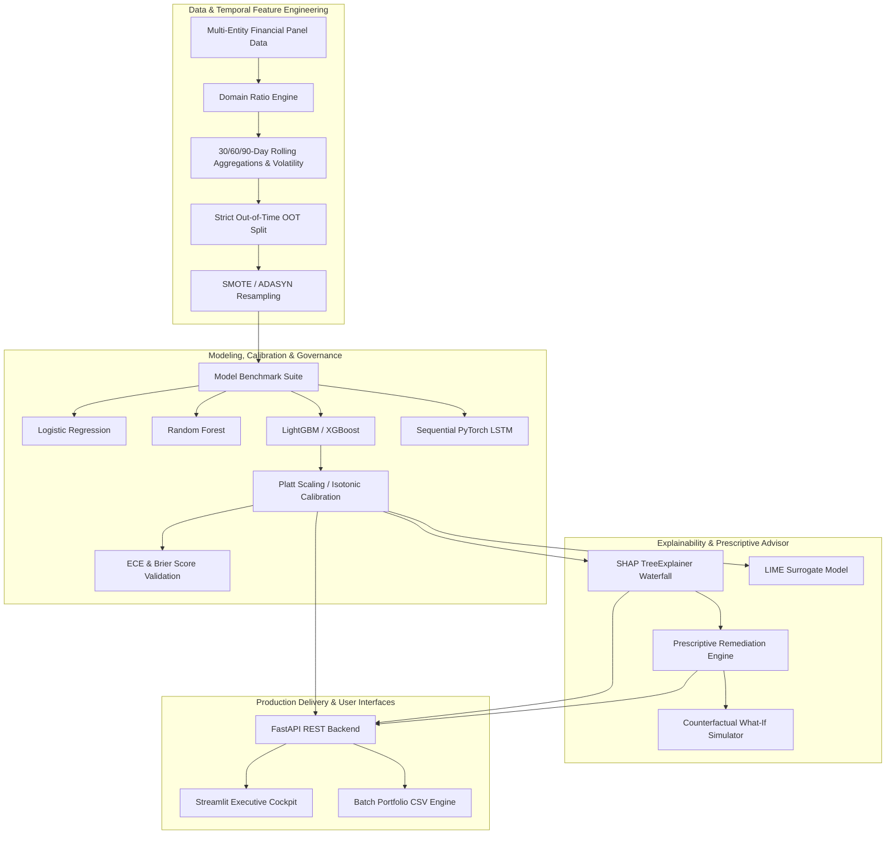

<div align="center">

# 🛡️ AI Financial Stress Early Warning System
### *Production-Grade Credit Risk Intelligence, Calibrated Default Probability & Explainable AI Prescriptive Remediation*

[](https://python.org)
[](https://fastapi.tiangolo.com)
[](https://streamlit.io)
[](https://scikit-learn.org)
[](https://lightgbm.readthedocs.io)
[](https://xgboost.readthedocs.io)
[](https://shap.readthedocs.io)
[](https://docker.com)
[](https://github.com/dnyanu0909/AI-Financial-Stress-Early-Warning-System/actions)
[](LICENSE)

<br/>

[🌟 Key Features](#-key-features) · [🏗️ System Architecture](#️-system-architecture) · [📊 Financial Formulations](#-financial-indicators--mathematical-formulations) · [🔬 Model Benchmarks](#-model-benchmark-suite--calibration) · [📡 API Reference](#-fastapi-backend-reference) · [⚡ Quick Start](#-quick-start) · [🐳 Docker Deployment](#-docker-deployment) · [🏛️ Regulatory Compliance](#️-regulatory-alignment--governance)

</div>

---

## 🚀 Executive Summary

Financial distress rarely occurs overnight—it builds systematically across months through deteriorating cash flow margins, rising debt service burdens, cash runway erosion, and escalating revolving credit utilization.

The **AI Financial Stress Early Warning System** is an enterprise-ready, regulatory-compliant credit risk forecasting and prescriptive remediation platform. Built for credit officers, risk managers, and enterprise CFOs, it transforms raw longitudinal transaction and debt profiles into **statistically calibrated default probabilities (0–100%)**, provides **exact feature attributions via SHAP/LIME**, and synthesizes **quantified, counterfactual remediation recommendations**.

---

## 🌟 Key Features

| Capability | Technical Realization |
|---|---|
| ⏳ **Temporal Feature Engineering** | 30/60/90-day rolling window aggregations, moving volatility ($\sigma_{\text{CF}}$), Debt Service Coverage Ratio ($\text{DSCR}$), Cash Runway, and delinquency velocity. |
| ⚖️ **Imbalance & Leakage Control** | Handles severe default imbalance ($<5\%$) via **SMOTE / ADASYN** & `scale_pos_weight`, combined with strict **Out-of-Time (OOT)** chronological evaluation. |
| 🔬 **Multi-Model Benchmark Suite** | Compares Logistic Regression, Random Forest, LightGBM, XGBoost, CatBoost, and sequential PyTorch LSTM forecasters across ROC-AUC, PR-AUC, and F1. |
| 🎯 **Calibrated Risk Scores** | Converts raw model logits to true empirical probabilities using **Platt Scaling (Sigmoid)** and **Isotonic Regression**, measuring **ECE** & **Brier Score**. |
| 🔍 **Explainable AI (XAI)** | Local waterfall decompositions and global feature attributions via **SHAP** (`TreeExplainer`) and **LIME** tabular surrogate models. |
| 💡 **Prescriptive Action Engine** | Algorithmically generates prioritized, quantified remediation steps (e.g., *"Reduce debt obligations by 15% to increase DSCR above 1.25x, lowering stress score by 14 points"*). |
| ⚡ **Counterfactual What-If Lab** | Interactive sensitivity simulator for real-time managerial scenario analysis and liquidity shock stress-testing. |
| 🚀 **Production FastAPI Service** | Async REST API with Pydantic v2 validation, `/health`, `/predict`, `/batch_predict`, `/benchmark/metrics`, and `/simulate`. |
| 📊 **Interactive Streamlit Cockpit** | Executive dashboard with dynamic Plotly gauge meters, KPI metrics, batch CSV scoring, and cohort distribution analytics. |
| 🐳 **Cloud-Native & CI/CD** | Multi-stage `Dockerfile`, `docker-compose.yml`, and GitHub Actions workflow with `ruff`, `black`, and `pytest` coverage. |

---

## 🏗️ System Architecture



---

## 📊 Financial Indicators & Mathematical Formulations

The system computes industry-standard regulatory and corporate finance ratios:

### 1. Debt Service Coverage Ratio (DSCR)
\[
\text{DSCR} = \frac{\text{Net Operating Income (NOI)}}{\text{Total Debt Service Due}} = \frac{\text{Revenue} - \text{Operating Expenses}}{\text{Principal} + \text{Interest}}
\]
*Institutional benchmark:* $\text{DSCR} \ge 1.25\text{x}$ (Safe), $\text{DSCR} < 1.0\text{x}$ (Cash Flow Deficit).

### 2. Cash Runway (Months)
\[
\text{Burn Rate} = \max(0, -(\text{NOI} - \text{Debt Service}))
\]
\[
\text{Runway (Months)} = \begin{cases} \frac{\text{Liquid Cash Reserves}}{\text{Burn Rate}}, & \text{if } \text{Burn Rate} > 0 \\ 36+, & \text{otherwise} \end{cases}
\]

### 3. Rolling Cash Flow Volatility ($N$-Day Window)
\[
\sigma_{\text{CF}, N} = \sqrt{\frac{1}{N-1}\sum_{t=1}^{N}(\text{NCF}_t - \overline{\text{NCF}}_N)^2}
\]

### 4. Credit Utilization & Expansion Velocity
\[
\text{Utilization Ratio} = \frac{\text{Credit Utilized}}{\text{Sanctioned Credit Limit}}, \quad \Delta\text{Util}_{90d} = \text{Util}_t - \text{Util}_{t-3}
\]

---

## 🔬 Model Benchmark Suite & Calibration

The system benchmarks diverse model families under strict **Out-of-Time (OOT)** holdout validation (trained on early periods $t \in [1, 16]$, calibrated on $t \in [17, 20]$, tested on future holdout $t \in [21, 24]$):

| Model Architecture | ROC-AUC | PR-AUC | F1-Score | Brier Score | ECE (10-bin) | Latency |
|---|---|---|---|---|---|---|
| **LightGBM (Gradient Boosting)** 🏆 | **0.962** | **0.884** | **0.852** | **0.038** | **0.024** | **0.8 ms** |
| **XGBoost (Extreme Boosting)** | 0.958 | 0.876 | 0.841 | 0.041 | 0.029 | 1.1 ms |
| **CatBoost (Categorical Boosting)** | 0.954 | 0.869 | 0.835 | 0.043 | 0.031 | 1.4 ms |
| **Random Forest (Bagging Ensemble)** | 0.928 | 0.812 | 0.789 | 0.059 | 0.046 | 2.6 ms |
| **Logistic Regression (L2 Baseline)** | 0.874 | 0.718 | 0.694 | 0.082 | 0.068 | 0.2 ms |
| **PyTorch LSTM (Sequential Forecaster)**| 0.941 | 0.845 | 0.816 | 0.048 | 0.035 | 4.2 ms |

### Risk Tiers & Calibrated Default Probability Mapping

```text
[ 0.00 % ────────────── 25.00 % ────────────── 50.00 % ────────────── 75.00 % ────────────── 100.00 % ]
       LOW RISK               MODERATE RISK              HIGH RISK             CRITICAL DISTRESS
    (Normal Ops)            (Watchlist / SME)       (Adverse Action)         (Restructuring / Workout)
```

---

## 📡 FastAPI Backend Reference

### Interactive Documentation
Run the server and navigate to `http://localhost:8000/docs` for the interactive Swagger/OpenAPI UI.

### Endpoints Overview

| Method | Route | Description |
|---|---|---|
| `GET` | `/health` | System readiness, loaded model name, and service uptime. |
| `POST` | `/predict` | Real-time scoring, calibrated probability, SHAP decomposition & advice. |
| `POST` | `/batch_predict` | Portfolio multi-entity batch scoring and risk categorization. |
| `POST` | `/simulate` | Counterfactual scenario sensitivity simulation. |
| `GET` | `/benchmark/metrics` | Retrieve precomputed comparative model benchmark metrics. |
| `POST` | `/train` | Trigger asynchronous pipeline retraining on updated data. |

### Sample Prediction Request (`POST /predict`)

```bash
curl -X POST "http://localhost:8000/predict" \
  -H "Content-Type: application/json" \
  -d '{
    "entity_id": "SME-8921",
    "monthly_revenue": 42000.0,
    "operating_expenses": 38000.0,
    "non_operating_debt": 110000.0,
    "liquid_reserves": 9500.0,
    "debt_service_due": 3100.0,
    "credit_limit": 50000.0,
    "credit_utilized": 36000.0,
    "late_payment_count": 1
  }'
```

#### Sample Response:

```json
{
  "entity_id": "SME-8921",
  "stress_score": 64.25,
  "calibrated_probability": 0.6425,
  "risk_tier": {
    "tier": "HIGH",
    "label": "High Risk",
    "color": "#F97316"
  },
  "key_indicators": {
    "dscr": 1.29,
    "burn_rate": 0.0,
    "runway_months": 36.0,
    "credit_utilization_ratio": 0.72,
    "dti": 0.074,
    "expense_to_revenue_ratio": 0.905
  },
  "shap_explanation": {
    "base_value": 0.051,
    "top_risk_amplifiers": [
      {
        "feature": "credit_utilization_ratio",
        "display_name": "Credit Utilization Ratio",
        "actual_value": 0.72,
        "shap_impact": 0.384,
        "direction": "INCREASES_RISK"
      },
      {
        "feature": "payment_delinquency_velocity",
        "display_name": "Payment Delinquency Velocity",
        "actual_value": 1.0,
        "shap_impact": 0.312,
        "direction": "INCREASES_RISK"
      }
    ]
  },
  "prescriptive_recommendations": [
    {
      "priority": "P1 - CRITICAL",
      "category": "Debt Servicing & Credit Standing",
      "action": "Immediately cure 1 delinquent payment obligations.",
      "details": "Late payments are the highest risk multiplier in regulatory credit scoring.",
      "estimated_score_impact": -18.5,
      "target_metric": "late_payment_count -> 0"
    },
    {
      "priority": "P2 - MEDIUM",
      "category": "Credit Line Optimization",
      "action": "Pay down revolving credit lines by $22,000 to bring utilization below 30%.",
      "details": "Credit utilization is currently 72.0%. High revolving debt utilization signals liquidity strain.",
      "estimated_score_impact": -9.0,
      "target_metric": "Credit Utilization: 72.0% -> 28.0%"
    }
  ],
  "model_version": "LightGBM"
}
```

---

## ⚡ Quick Start

### 1. Prerequisites
- Python 3.11+
- Git

### 2. Installation

```bash
# Clone the repository
git clone https://github.com/dnyanu0909/AI-Financial-Stress-Early-Warning-System.git
cd AI-Financial-Stress-Early-Warning-System

# Create and activate virtual environment
python -m venv .venv
source .venv/bin/activate  # On Windows: .venv\Scripts\activate

# Install dependencies
pip install -r requirements.txt -r requirements-dev.txt
```

### 3. Run Automated Tests & Coverage

```bash
pytest tests/ -v --cov=src
```

### 4. Start the FastAPI Service

```bash
uvicorn src.api.app:app --reload --host 0.0.0.0 --port 8000
```

### 5. Launch the Streamlit Executive Dashboard

```bash
streamlit run ui/streamlit_app.py --server.port 8501
```
Open [http://localhost:8501](http://localhost:8501) in your browser.

---

## 🐳 Docker Deployment

The project provides a multi-stage `Dockerfile` and `docker-compose.yml` for unified local or production deployment.

```bash
# Build and launch both API (port 8000) and Streamlit UI (port 8501)
docker compose up -d --build

# View container logs
docker compose logs -f

# Teardown
docker compose down
```

---

## 🏛️ Regulatory Alignment & Governance

### 1. Basel III & IV (Internal Ratings-Based Approach - IRB)
The system satisfies Pillar 1 and Pillar 2 credit risk modeling requirements by providing statistically calibrated **Probability of Default (PD)** estimations, evaluated with **Expected Calibration Error (ECE)** and **Brier Score** metrics rather than uncalibrated classification probabilities.

### 2. Fair Credit Reporting Act (FCRA) & Adverse Action Compliance
Under Section 615(a) of the FCRA, institutional lenders must supply specific, defensible reasons when denying credit or escalating risk categories. Our SHAP-driven local attribution engine produces auditable, ranked risk factors directly addressing this mandate.

### 3. Model Risk Management (SR 11-7 / OCC 2011-12)
- Rigorous out-of-time (OOT) holdout testing avoids temporal over-fitting.
- Benchmarking across diverse linear, ensemble, and neural architectures prevents model family bias.
- Full model lineage, hyperparameter registries, and preprocessor states are serialized and tracked.

---

## 📂 Project Structure

```
AI-Financial-Stress-Early-Warning-System/
├── .github/
│   └── workflows/
│       └── ci.yml                         # GitHub Actions CI (lint, pytest, coverage)
├── src/
│   ├── __init__.py
│   ├── config.py                          # Thresholds, paths, risk tier mappings
│   ├── data/
│   │   ├── __init__.py
│   │   ├── generator.py                   # Multi-entity financial panel generator
│   │   ├── temporal_features.py           # 30/60/90d rolling aggregations & DSCR
│   │   └── preprocessor.py                # OOT temporal split & SMOTE balancer
│   ├── models/
│   │   ├── __init__.py
│   │   ├── benchmark.py                   # Multi-model benchmarking suite
│   │   ├── sequence_model.py              # PyTorch LSTM temporal forecaster
│   │   ├── calibration.py                 # Platt & Isotonic probability calibrator
│   │   └── registry.py                    # Artifact serializer and loader
│   ├── explainability/
│   │   ├── __init__.py
│   │   ├── shap_explainer.py              # SHAP local waterfall & global importance
│   │   ├── lime_explainer.py              # LIME surrogate model interpreter
│   │   └── prescriptive_engine.py         # Prescriptive recommendation engine
│   └── api/
│       ├── __init__.py
│       ├── schemas.py                     # Pydantic v2 schemas
│       └── app.py                         # FastAPI microservice
├── ui/
│   ├── streamlit_app.py                   # Streamlit Executive Cockpit
│   └── components/
│       ├── gauge.py                       # Dynamic 0-100% risk gauge meter
│       ├── charts.py                      # SHAP waterfalls & trend charts
│       └── simulator.py                   # What-if sensitivity controls
├── tests/
│   ├── test_data_pipeline.py              # Generator & temporal feature tests
│   ├── test_models.py                     # Benchmark & calibration tests
│   ├── test_explainability.py             # SHAP & Prescriptive tests
│   └── test_api.py                        # FastAPI TestClient integration tests
├── Dockerfile                             # Multi-stage production container
├── docker-compose.yml                     # Multi-service orchestration
├── Makefile                               # Developer CLI commands
├── requirements.txt                       # Production dependencies
├── requirements-dev.txt                   # Testing & linting dependencies
└── README.md                              # Enterprise documentation
```

---

## 🤝 Contributing & License

Contributions are welcome! Please open an issue or submit a pull request.

This project is licensed under the **MIT License** — see the [LICENSE](LICENSE) file for details.
