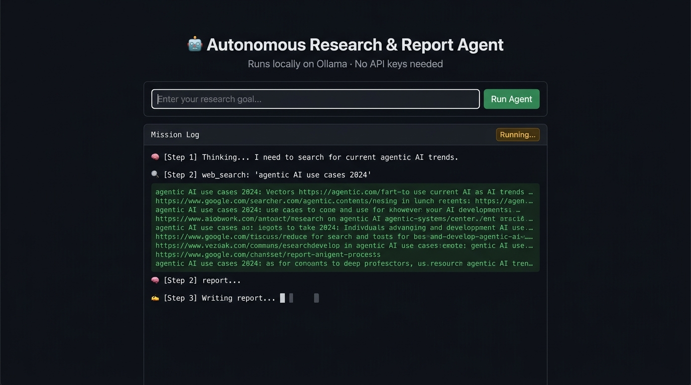
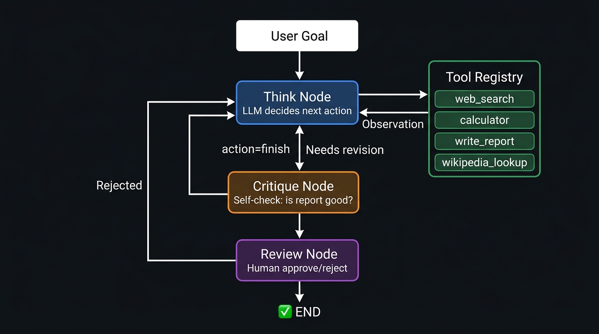
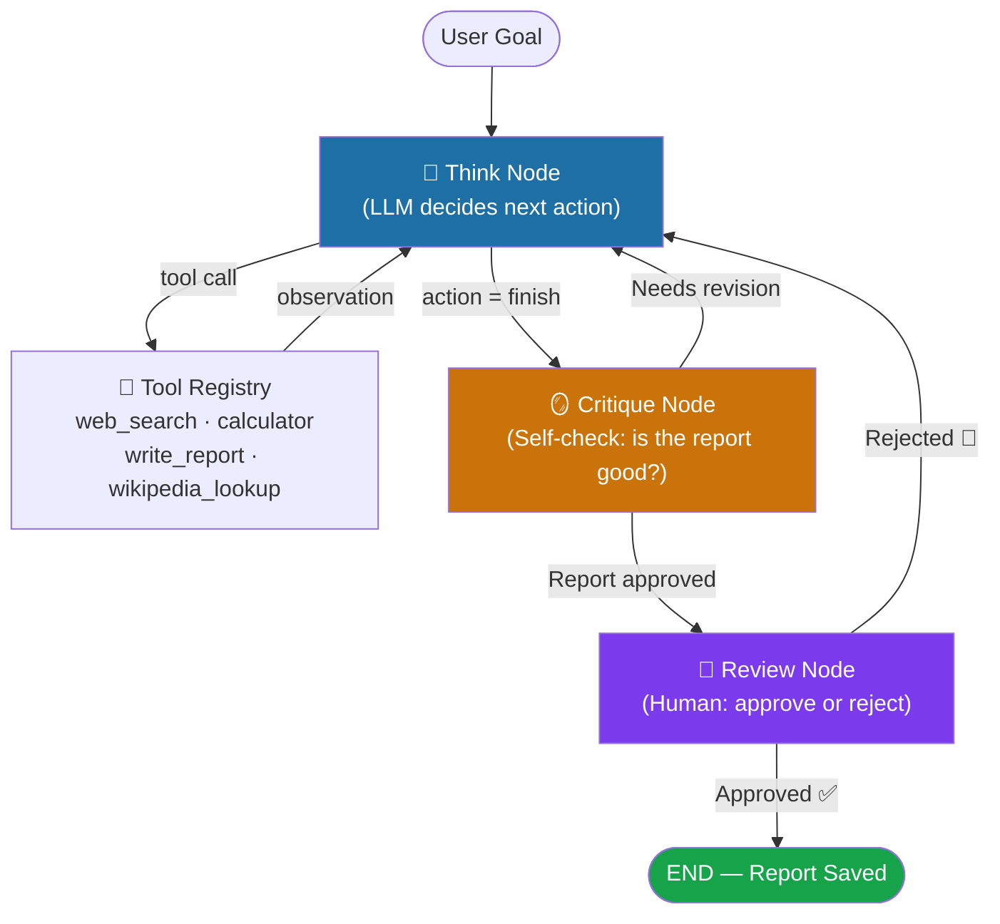

<div align="center">

# 🤖 Autonomous Research & Report Agent

**Give it a goal. Watch it think, search, critique, and deliver a polished research report — all running locally on your machine.**

[](https://python.org)
[](https://langchain-ai.github.io/langgraph/)
[](https://fastapi.tiangolo.com)
[](https://ollama.com)
[](https://docker.com)
[](LICENSE)
[](https://github.com/dnyanu0909/agentic-research-agent/actions)

<br/>

[🎬 Demo](#-demo) · [⚡ Quick Start](#-quick-start) · [🏗️ Architecture](#️-architecture) · [📡 API Reference](#-api-reference) · [🐳 Docker](#-docker-setup) · [🤝 Contributing](#-contributing)

</div>

---

## 🎬 Demo



> **Example goal:** *"Research the current state of agentic AI and summarize 3 real-world use cases"*
>
> The agent plans its own steps, runs multiple web searches, writes a structured Markdown report, critiques its own output, and then pauses for **your approval** before saving — all without a single API key.

---

## ✨ What Makes This "Agentic"?

Most "AI" apps are fixed pipelines: prompt in → answer out. This project is different.

| Property | What It Means Here |
|---|---|
| 🧠 **Planning** | The LLM decides its own next action at every step — it is not hardcoded |
| 🔧 **Tool Use** | Calls real tools (`web_search`, `calculator`, `write_report`, `wikipedia_lookup`) and reacts to their output |
| 🔁 **Autonomy** | Loops `Think → Act → Observe` until the goal is met or the step budget runs out |
| 🪞 **Self-Critique** | Before finishing, the agent critiques its own draft report and revises if it falls short |
| 👤 **Human-in-the-Loop** | After passing self-critique, the draft is streamed to the user for approval or rejection with feedback |
| 💰 **Zero Cost** | Runs entirely on a local [Ollama](https://ollama.com) model — no OpenAI, no Anthropic, no billing |

---

## ⚡ Quick Start

### 🌐 Try It Instantly (Cloud Demo)

No setup or local installation required:

👉 **[Launch Live Web App](https://agentic-research-agent-six.vercel.app)**

---

### 💻 Run Locally

> **Prerequisites:** [Python 3.11+](https://python.org) and [Ollama](https://ollama.com) installed and running.

```bash
# 1. Clone the repo
git clone [https://github.com/dnyanu0909/agentic-research-agent.git](https://github.com/dnyanu0909/agentic-research-agent.git)
cd agentic-research-agent

# 2. Pull a local model (one-time)
ollama pull mistral

# 3. Install Python dependencies & start the server
python -m venv venv
venv\Scripts\activate          # Windows
# source venv/bin/activate     # macOS / Linux
pip install -r requirements.txt
uvicorn main:app --reload

# 4. Open your browser 🎉
#    [http://127.0.0.1:8000](http://127.0.0.1:8000)
```

Enter a research goal and watch the agent work in real time.

---

## 🏗️ Architecture



The agent is implemented as a **3-node LangGraph state machine**:



### The Loop in Plain English

1. **Think** — The LLM receives the goal + full action history and outputs a JSON decision: `{thought, action, action_input}`
2. **Act** — The chosen tool runs; its output becomes the `observation`
3. **Observe** — The observation is appended to history; loop back to Think
4. **Critique** — Once the agent calls `finish`, a second LLM pass reviews the draft report against the original goal. If it finds gaps, the critique is injected back into history and the loop restarts.
5. **Human Review** — The approved draft is streamed to the browser for your final say. Rejecting it sends your feedback back into the agent loop.

---

## 🛠️ Tech Stack

| Layer | Technology | Role |
|---|---|---|
| **Agent Framework** | [LangGraph](https://langchain-ai.github.io/langgraph/) 1.2.9 | State machine, checkpointing, interrupt/resume |
| **LLM Runtime** | [Ollama](https://ollama.com) + [langchain-ollama](https://python.langchain.com/docs/integrations/llms/ollama/) | Local model inference (Mistral, Llama 3, Qwen 2.5…) |
| **Web Search** | [DuckDuckGo Search](https://pypi.org/project/duckduckgo-search/) + Wikipedia REST API | Free, no-key web retrieval with fallback |
| **Backend** | [FastAPI](https://fastapi.tiangolo.com) + [Uvicorn](https://www.uvicorn.org) | REST + Server-Sent Events (SSE) streaming |
| **Frontend** | Vanilla HTML/JS | Terminal-style live log — no build step |
| **Containerisation** | Docker + docker-compose | One-command deployment |

---

## 📁 Project Structure

```
agentic-research-agent/
│
├── agent.py               # LangGraph graph — Think / Critique / Review nodes
├── tools.py               # Tool implementations + TOOL_REGISTRY
├── main.py                # FastAPI server — /run, /run-stream, /resume-stream
│
├── static/
│   └── index.html         # Terminal-style frontend (SSE consumer)
│
├── reports/               # Auto-generated Markdown reports (git-ignored)
│
├── tests/
│   ├── test_tools.py      # Unit tests for calculator, write_report, text cleaning
│   └── test_agent.py      # Smoke tests for graph structure & API endpoints
│
├── docs/
│   └── screenshots/       # UI screenshots for README
│
├── .github/
│   ├── workflows/ci.yml   # GitHub Actions — lint (ruff) + pytest
│   ├── CONTRIBUTING.md
│   ├── PULL_REQUEST_TEMPLATE.md
│   └── ISSUE_TEMPLATE/
│       ├── bug_report.yml
│       └── feature_request.yml
│
├── Dockerfile
├── docker-compose.yml
├── requirements.txt        # Runtime dependencies
├── requirements-dev.txt    # Dev dependencies (ruff, pytest)
├── .env.example            # Environment variable template
├── CHANGELOG.md
└── LICENSE                 # MIT
```

---

## 🔧 Configuration

Copy `.env.example` to `.env` and adjust as needed:

```bash
cp .env.example .env
```

| Variable | Default | Description |
|---|---|---|
| `OLLAMA_MODEL` | `mistral` | Model to use. Must be pulled via `ollama pull <model>` |
| `OLLAMA_BASE_URL` | `http://localhost:11434` | Ollama server URL |
| `MAX_STEPS` | `14` | Hard cap on Think → Act loops per run |

### Recommended Models

| Model | Size | Notes |
|---|---|---|
| `mistral` | ~4 GB | Default · Good JSON compliance · Fast |
| `llama3.1` | ~4.7 GB | Strong reasoning · Slightly slower |
| `qwen2.5:7b` | ~4.4 GB | Excellent at following structured output |
| `phi3` | ~2.3 GB | Fastest · Best for low-RAM machines |

```bash
# Switch model without editing code
$env:OLLAMA_MODEL = "llama3.1"   # PowerShell
export OLLAMA_MODEL=llama3.1     # bash / zsh
uvicorn main:app --reload
```

---

## 🔧 Detailed Setup

### Prerequisites

- **Python 3.11+** — [python.org](https://python.org)
- **Ollama** — [ollama.com](https://ollama.com) (install, then run `ollama serve`)
- **Git**

### Step-by-Step

```bash
# Clone
git clone https://github.com/dnyanu0909/agentic-research-agent.git
cd agentic-research-agent

# Virtual environment
python -m venv venv

# Activate
venv\Scripts\activate        # Windows PowerShell
source venv/bin/activate     # macOS / Linux

# Install dependencies
pip install -r requirements.txt

# (Optional) Install dev tools for testing & linting
pip install -r requirements-dev.txt

# Pull your chosen model
ollama pull mistral

# Start the server
uvicorn main:app --reload
```

Open **[http://127.0.0.1:8000](http://127.0.0.1:8000)** and enter a goal like:

> *"Research the pros and cons of microservices architecture and give 3 real-world examples"*

Reports are also saved as `.md` files in the `reports/` folder.

---

## 🐳 Docker Setup

Run the full stack with a single command (requires Ollama running on the host):

```bash
# Build and start
docker-compose up --build

# Open http://localhost:8000
```

The `docker-compose.yml` maps port 8000 and sets `OLLAMA_BASE_URL` to communicate with the host's Ollama instance automatically.

To use a specific model:

```bash
OLLAMA_MODEL=llama3.1 docker-compose up --build
```

---

## 📡 API Reference

The FastAPI backend exposes three endpoints. Interactive docs available at **[http://127.0.0.1:8000/docs](http://127.0.0.1:8000/docs)**.

### `POST /run`
Run the agent synchronously (blocks until done).

```bash
curl -X POST http://localhost:8000/run \
  -H "Content-Type: application/json" \
  -d '{"goal": "What is quantum computing? Give 2 use cases."}'
```

**Response:**
```json
{
  "goal": "What is quantum computing? Give 2 use cases.",
  "steps": [
    {
      "thought": "I need to search for quantum computing basics.",
      "action": "web_search",
      "action_input": "quantum computing introduction use cases 2024",
      "observation": "1. IBM Quantum..."
    }
  ],
  "report": "# Quantum Computing\n\n## Summary\n...",
  "final_message": "Report approved by self-critique step."
}
```

---

### `GET /run-stream`
Stream agent steps in real time via **Server-Sent Events (SSE)**.

```
GET /run-stream?goal=<your+goal>&thread_id=<optional-uuid>
```

Each SSE event is a JSON object of one of these shapes:

| `type` | Description |
|---|---|
| `step` | A single Think → Act → Observe cycle: `{type, step: {thought, action, action_input, observation}}` |
| `approval_required` | Graph paused for human review: `{type, thread_id, draft}` |
| `final` | Run complete: `{type, report, final_message}` |

---

### `POST /resume-stream`
Resume a paused graph after human review.

```bash
curl -X POST http://localhost:8000/resume-stream \
  -H "Content-Type: application/json" \
  -d '{"thread_id": "<thread-id-from-approval_required>", "approved": true}'
```

Pass `"approved": false` and optionally add a `"feedback"` field to send the draft back for revision.

---

### `GET /health`
Health check.

```bash
curl http://localhost:8000/health
# {"status": "ok"}
```

---

## 🧪 Running Tests

```bash
# Install dev dependencies first
pip install -r requirements-dev.txt

# Run all tests
pytest tests/ -v

# With coverage report
pytest tests/ -v --cov=. --cov-report=term-missing

# Lint
ruff check .
```

---

## ⚠️ Known Limitations & Trade-offs

These are intentional trade-offs worth understanding (and mentioning in a technical discussion):

| Limitation | Reason / Trade-off |
|---|---|
| **JSON reliability varies by model** | Smaller local models (< 7B) occasionally output malformed JSON; the agent retries automatically, but it isn't 100% reliable. Larger models (Llama 3.1, Qwen 2.5:7b) are more consistent. |
| **`MAX_STEPS` hard cap** | The loop is capped at 14 steps to guarantee termination. A production agent would use a smarter stopping condition (e.g. goal-completion classifier). |
| **DuckDuckGo rate limits** | The web search uses DuckDuckGo's unofficial endpoint, which can rate-limit under heavy use. The agent falls back to Wikipedia automatically. |
| **In-memory checkpointing** | `InMemorySaver` is used — state is lost on server restart. A production system would use a persistent store (e.g. PostgreSQL via `langgraph-checkpoint-postgres`). |
| **Single-process only** | The SSE streaming model assumes a single Uvicorn worker. Multi-worker deployments require an external message broker. |

---

## 🤝 Contributing

Contributions are welcome! Please read [CONTRIBUTING.md](.github/CONTRIBUTING.md) first.

```bash
# Quick contribution workflow
git fork https://github.com/dnyanu0909/agentic-research-agent
git checkout -b feat/your-feature
# ... make changes ...
pytest tests/ -v && ruff check .
git push && open a PR
```

See [open issues](https://github.com/dnyanu0909/agentic-research-agent/issues) for ideas.

---

## 📄 License

Distributed under the **MIT License**. See [LICENSE](LICENSE) for details.

---

<div align="center">

**Built with ❤️ using LangGraph · FastAPI · Ollama**

If this project helped you, consider giving it a ⭐ on GitHub!

</div>
